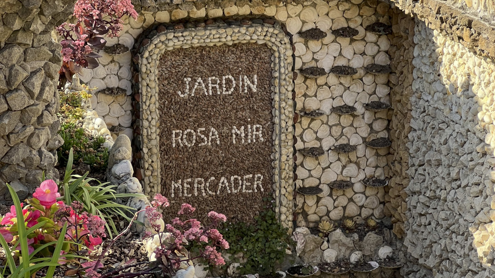

# Image Processing Application

Welcome to the **Image Processing Application** project, developed as part of the **Web Application Development** course. This application allows users to modify image formats, convert images to black and white, and apply a blur effect. It is designed to be user-friendly while offering powerful image processing features.

## Table of Contents

- [Features](#features)
- [Installation](#installation)
- [Usage](#usage)
- [Examples](#examples)
- [Contributing](#contributing)

## Features

- **Image Ratio Modification**: Modifies the format ratio of your image. For exampe, if you insert a squared image, it can crop it to 4/5.
- **Black and White Conversion**: Transform your image to grayscal.
- **Blur Effect**: Apply a blur effect on the whole image.

## Installation

### Prerequisites

- **Java JDK 21**
- **Maven** for dependency management and building the project
- **Git** for cloning the repository

### Clone the Repository

Open your terminal and run the following command to clone the repository:

```bash
git clone https://github.com/HEIG-VD-DAI-Iseni-Jacobs/pictures-cli-editor.git
```

### Build the Project

Navigate to the cloned project directory and use Maven to build the application:

```bash
cd pictures-cli-editor
mvn clean && mvn spotless:apply && mvn dependency:go-offline && mvn package
```

## Usage

Once the project is built, you can run the application using the following command:

```bash
java -jar target/pictures-cli-editor-1.0-SNAPSHOT.jar <inputPath> <outputPath> <command>
```

The application provides a command-line interface where you can choose the desired image processing options.

### Required parameters
1. **input path** specifies which picture you want to modify
2. **output path** specifies where you want to save the modified image and .bmp at the end of the filename.

### Available Options
1. **grey**
2. **blur**
3. **crop**

Select the desired option by entering the corresponding name.

## Examples

### Format Conversion

**Before:**


**Used command**
````shell
java -jar target/pictures-cli-editor-1.0-SNAPSHOT.jar src/resources/pictures/rosa_mir.bmp src/resources/pictures/rosa_mir_16_9.bmp crop -f 16/9

````

**After:**


### Black and White Conversion

**Before:**


**Used command**
````shell
java -jar target/pictures-cli-editor-1.0-SNAPSHOT.jar src/resources/pictures/bato.bmp src/resources/pictures/bato_grey.bmp grey

````

**After:**


### Image Blurring

**Before:**


**After:**


## Contributing

Contributions are welcome! To contribute:

1. Create an issue describing the feature you want to implement
2. Fork the project and clone it 
3. Create your feature branch
````shell
git checkout -b feature/my-feature
````
4. Commit your changes
````shell
git commit -m "Add my feature"
````
5. Push the branch
```shell
git push
```
6. Open a Pull Request

If you have any questions or suggestions, feel free to open an [issue](https://github.com/HEIG-VD-DAI-Iseni-Jacobs/pictures-cli-editor/issues) on GitHub.
