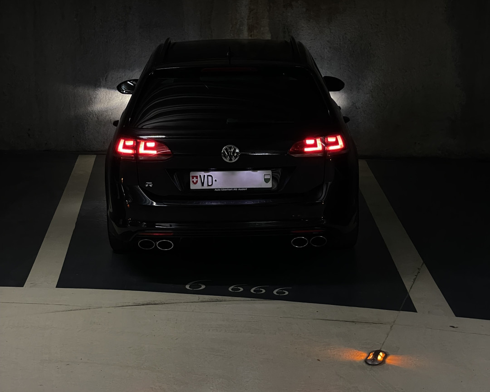

# Image Processing Application

Welcome to the **Image Processing Application** project, developed as part of the [**Web Application Development
**](https://github.com/heig-vd-dai-course) course. This CLI application allows users to modify image formats, convert
images to black and white, and apply a blur effect. It is designed to be user-friendly while offering powerful image
processing features.

## Table of Contents

- [Features](#features)
- [Installation](#installation)
- [Usage](#usage)
- [Examples](#examples)
- [Contributing](#contributing)

## Features

- **Image Ratio Modification**: Modifies the format ratio of your image. For example, if you insert a squared image, it
  can crop it to 4/5.
- **Black and White Conversion**: Transform your image to grayscale.
- **Blur Effect**: Apply a blur effect on the whole image or part of it. Blur strength can be adjusted.

## Installation

### Prerequisites

- **Java JDK 21**
- **Maven** for dependency management and building the project
- **Git** for cloning the repository

### Clone the Repository

Open your terminal and run the following command to clone the repository:

```bash
git clone https://github.com/HEIG-VD-DAI-Iseni-Jacobs/pictures-cli-editor.git
```

### Build the Project

Navigate to the cloned project directory and use Maven to build the application:

```bash
cd pictures-cli-editor
mvn spotless:apply dependency:go-offline clean compile package
```

## Usage

Once the project is built, you can run the application using the following command:

```bash
java -jar target/pictures-cli-editor-1.0-SNAPSHOT.jar <inputPath> <outputPath> <command>
```

The application provides a command-line interface where you can choose the desired image processing options.

### Required parameter

1. **input path** specifies which picture you want to modify

### Optional parameter

1. **output path** specifies where you want to save the modified image. If not provided, the input path will be used
   and "_edited" will be appended to the file name before the extension. The output file will always be in .bmp format.

### Available Commands

1. **grey**
2. **blur**
3. **crop**

Select the desired option by entering the corresponding name.

### Converting pictures to .bmp

The pictures were taken by ourselves. We had to convert them to bmp and reduce their size as bmp is not optimised and
takes
much space. For this purpose, two options are possible:

- Use online converters such as [convertio](https://convertio.co/fr/download/)
  and [reduceimages](https://www.reduceimages.com/)
- Use [magick](https://imagemagick.org/index.php), a dedicated CLI software. Here's the command used :  
  `magick mogrify -resize 1080x1620 -depth 8 -format bmp *.jpg`

## Examples

### Cropping

| **Before:**                                              | **After:**                                           |
|----------------------------------------------------------|------------------------------------------------------|
|  |  |

**Used command**

````shell
java -jar target/pictures-cli-editor-1.0-SNAPSHOT.jar src/resources/pictures/golf_7r.bmp output_examples/golf_7r_5_4.bmp crop -f 5/4
````

### Black and White Conversion

| **Before:**                                                    | **After:**                                                  |
|----------------------------------------------------------------|-------------------------------------------------------------|
|  |  |

**Used command**

````shell
java -jar target/pictures-cli-editor-1.0-SNAPSHOT.jar src/resources/pictures/rosa_mir.bmp output_examples/rosa_mir_grey.bmp grey

````

### Image Blurring

| **Before:**                                     | **After:**                                      |
|-------------------------------------------------|-------------------------------------------------|
|  |  |

**Used command**

````shell
java -jar target/pictures-cli-editor-1.0-SNAPSHOT.jar ./src/resources/pictures/bird.bmp ./output_examples.bmp blur -r 10 --x1 550 --y1 700 --x2 750 --y2 900
````

## Limitations

We are aware of a few problems. Here's a list of what we're working on at the moment:

- When cropping an image to a ratio that's smaller than it's original ratio, the program crashes

## Contributing

Contributions are welcome! To contribute:

1. Create an issue describing the feature you want to implement
2. Fork the project and clone it
3. Create your feature branch

````shell
git checkout -b feature/my-feature
````

4. Commit your changes

````shell
git commit -m "Add my feature"
````

5. Push the branch

```shell
git push
```

6. Open a Pull Request

If you have any questions or suggestions, feel free to open
an [issue](https://github.com/HEIG-VD-DAI-Iseni-Jacobs/pictures-cli-editor/issues) on GitHub.
